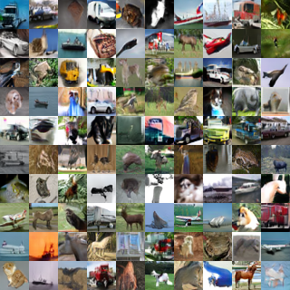
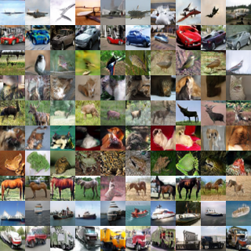

# Whitening and Coloring transform for GANs

[Check out our paper](https://arxiv.org/abs/1806.00420)
<p>
  <table>
	<tr>
           <td>  <figcaption align="center">Unsupervised Cifar-10 (IS 8.66)</figcaption> </td>
           <td>  <figcaption align="center">Supervised Cifar-10 (IS 9.06)</figcaption> </td>
        </tr>
  </table> 
</p>

### Requirments
* python2
* numpy
* scipy
* skimage
* pandas
* tensorflow == 1.5.0 (I have not testted with other versions)
* keras == 2.0.8 (I have tried latter versions, but they throw a bug. Not sure from where it came from)
* tqdm 


For the commands reproducing experiments from the paper check scripts folder.

All scripts has the following name: (name of the dataset) + (architecture type (resnet or dcgan)) +
(discriminator normalization (sn or wgan_gp)) + (conditional of unconditional) + (if conditional use soft assigment (sa)).

For example:

```CUDA_VISIBLE_DEVICES=0 scripts/cifar10_resnet_sn_uncond.sh```

will train GAN for cifar10 dataset, with resnet architecture, spectral normalized discriminator in unconditional case.
